### About

AI engineer specializing in agentic systems, LLM applications, and computer vision with a Bachelor Degree in Artificial Intelligence Engineering, Bahçeşehir University (2026)
I build and ship AI products and have hands-on industry experience deploying RAG pipelines and multi-agent workflow orchestration.
Bilingual in Arabic & English · based in Riyadh, Saudi Arabia.

IBM Deep Learning & Machine Learning Specializations 

### Featured work

**[Mudeer](https://github.com/m7md-aiman/Mudeer)** — Arabic-first multi-agent operations assistant on Microsoft Foundry: three specialized agents (Customer Service, Document, Compliance) with Arabic RAG via Azure AI Search for ZATCA-compliant VAT processing, secured with managed-identity auth and Content Safety filters.

**[AI Traffic System — ATMMS](https://github.com/m7md-aiman/AI-Traffic-System)** — led a 4-person team building an adaptive traffic-control platform: YOLOv11m + ByteTrack perception driving four signal-control policies in SUMO, cutting average vehicle wait times 40–54% versus fixed-time control.

**[XAI for Autonomous Vehicles](https://github.com/m7md-aiman/XAI-Autonomous-Vehicles)** — explainable object detection for driving scenes with YOLOv5, Grad-CAM, and SHAP.

**[Follow-Me Robot](https://github.com/m7md-aiman/Computer-Vision-Follow-Me-Robot)** — a computer-vision robot that detects, tracks, and follows a person in real time.

### Research

**["A Comprehensive Analysis on Hallucinations in Large Language Models"](https://ieeexplore.ieee.org/document/11537214)** — ICHORA 2026 (IEEE), Ankara, May 2026. 
[Paper on IEEE Xplore →](https://ieeexplore.ieee.org/document/11537214) · [Code & materials →](https://github.com/m7md-aiman/llm-hallucinations-paper)

### Stack

**Agents & LLMs** — `Python` · `LangChain` · `Microsoft Agent Framework` · `RAG` · `Hugging Face` · `Prompt Engineering` · `Fine-tuning` 
**ML & Vision** — `PyTorch` · `TensorFlow` · `YOLO` · `OpenCV` · `Deep Learning` 
**Platforms & Tools** — `Azure AI` · `Microsoft Foundry` · `FastAPI` · `Docker` · `n8n` · `Apache Airflow` · `Supabase` · `React` · `Streamlit`

### Contact

[LinkedIn](https://www.linkedin.com/in/mohamed-alkhozendar) · [moh-khz@hotmail.com](mailto:moh-khz@hotmail.com)
